# 📚 COMPREHENSIVE GUIDE: Adding New Cryptographic Schemes

## 🎯 EXTENSIBLE ARCHITECTURE OVERVIEW

```mermaid
graph TB
    subgraph "🏗️ EXTENSIBLE FRAMEWORK DESIGN"
        subgraph "📋 Abstract Layer"
            KE_BASE[KeyExchange Base<br/>━━━━━━━━━━━━<br/>• generatePrivateKey<br/>• generatePublicKey<br/>• computeSharedSecret<br/>• validatePublicKey<br/>• getParameters]

            SIG_BASE[SignatureBase<br/>━━━━━━━━━━━━<br/>• generateSignatureKeyPair<br/>• signMessage<br/>• verifySignature<br/>• getSignatureSize]
        end

        subgraph "🏭 Factory Layer"
            KE_FACTORY[KeyExchangeFactory<br/>━━━━━━━━━━━━<br/>Registry Map<br/>algorithm → Class]

            SIG_FACTORY[SignatureFactory<br/>━━━━━━━━━━━━<br/>Registry Map<br/>keyExchange → SignatureClass]
        end

        subgraph "🔧 Implementation Layer - Current"
            ECDH[ECDH P-192<br/>━━━━━━━━━━━━<br/>✅ Implemented]
            ECDSA[ECDSA P-192<br/>━━━━━━━━━━━━<br/>✅ Implemented]
        end

        subgraph "🆕 Implementation Layer - NEW (Example: RSA)"
            RSA_KE[RSA-2048<br/>━━━━━━━━━━━━<br/>🆕 To be added]
            RSA_SIG[RSA-PSS-2048<br/>━━━━━━━━━━━━<br/>🆕 To be added]
        end

        subgraph "🔮 Future Implementations"
            DH[Diffie-Hellman<br/>━━━━━━━━━━━━<br/>Future]
            DSA[DSA Signature<br/>━━━━━━━━━━━━<br/>Future]

            ED25519[Ed25519<br/>━━━━━━━━━━━━<br/>Future]
            ED25519_SIG[Ed25519 Pure<br/>━━━━━━━━━━━━<br/>Future]

            KYBER[CRYSTALS-Kyber<br/>━━━━━━━━━━━━<br/>Post-Quantum<br/>Future]
            DILITHIUM[CRYSTALS-Dilithium<br/>━━━━━━━━━━━━<br/>Post-Quantum<br/>Future]
        end

        KE_BASE --> KE_FACTORY
        SIG_BASE --> SIG_FACTORY

        KE_FACTORY --> ECDH
        KE_FACTORY --> RSA_KE
        KE_FACTORY -.-> DH
        KE_FACTORY -.-> ED25519
        KE_FACTORY -.-> KYBER

        SIG_FACTORY --> ECDSA
        SIG_FACTORY --> RSA_SIG
        SIG_FACTORY -.-> DSA
        SIG_FACTORY -.-> ED25519_SIG
        SIG_FACTORY -.-> DILITHIUM
    end

    subgraph "🔄 Algorithm Mapping"
        MAPPING["User → Algorithm Mapping<br/>━━━━━━━━━━━━━━━━━━<br/>'group-1' → 'ecdh'<br/>'group-2' → 'rsa'<br/>'group-3' → 'dh'<br/>'group-4' → 'ed25519'<br/><br/>Algorithm → Signature<br/>━━━━━━━━━━━━━━━━━━<br/>'ecdh' → ECDSA<br/>'rsa' → RSA-PSS<br/>'dh' → DSA<br/>'ed25519' → Ed25519"]
    end

    style KE_BASE fill:#e3f2fd
    style SIG_BASE fill:#e3f2fd
    style KE_FACTORY fill:#fff9c4
    style SIG_FACTORY fill:#fff9c4
    style ECDH fill:#c8e6c9
    style ECDSA fill:#c8e6c9
    style RSA_KE fill:#ffccbc
    style RSA_SIG fill:#ffccbc
    style MAPPING fill:#f0f4c3
```



---

## 📖 STEP-BY-STEP GUIDE: Adding RSA-2048

### 🌐 PART 1: SERVER-SIDE IMPLEMENTATION (Cloudflare Worker)

#### **Step 1: Create RSA Key Exchange Algorithm**

**File:** `src/crypto/rsa.js`

```javascript
// ============================================
// RSA-2048 Key Exchange Implementation
// Uses Web Crypto API for RSA operations
// ============================================

import { KeyExchange } from "./keyExchange.js";

export class RSA extends KeyExchange {
  constructor(keySize = 2048) {
    super("RSA-" + keySize);
    this.keySize = keySize;
    this.publicExponent = 65537n; // Standard e = 2^16 + 1
    console.log(`RSA initialized with ${keySize}-bit keys`);
  }

  // ━━━━━━━━━━━━━━━━━━━━━━━━━━━━━━━━━━━━━━
  // KEY GENERATION
  // ━━━━━━━━━━━━━━━━━━━━━━━━━━━━━━━━━━━━━━

  async generateKeyPair() {
    try {
      const keyPair = await crypto.subtle.generateKey(
        {
          name: "RSA-OAEP",
          modulusLength: this.keySize,
          publicExponent: new Uint8Array([1, 0, 1]), // 65537
          hash: "SHA-256",
        },
        true, // extractable
        ["encrypt", "decrypt"]
      );

      // Export to JWK format
      const publicKeyJwk = await crypto.subtle.exportKey(
        "jwk",
        keyPair.publicKey
      );
      const privateKeyJwk = await crypto.subtle.exportKey(
        "jwk",
        keyPair.privateKey
      );

      return {
        publicKey: {
          n: publicKeyJwk.n,
          e: publicKeyJwk.e,
          keySize: this.keySize,
        },
        privateKey: {
          n: privateKeyJwk.n,
          e: privateKeyJwk.e,
          d: privateKeyJwk.d,
          p: privateKeyJwk.p,
          q: privateKeyJwk.q,
          dp: privateKeyJwk.dp,
          dq: privateKeyJwk.dq,
          qi: privateKeyJwk.qi,
        },
      };
    } catch (error) {
      console.error("RSA key generation error:", error);
      throw new Error("Failed to generate RSA key pair");
    }
  }

  generatePrivateKey() {
    // For RSA, we generate full keypair
    // Return the promise for consistency
    return this.generateKeyPair();
  }

  generatePublicKey(privateKeyData) {
    // Extract public key from private key data
    return {
      n: privateKeyData.n,
      e: privateKeyData.e,
      keySize: privateKeyData.keySize || this.keySize,
    };
  }

  // ━━━━━━━━━━━━━━━━━━━━━━━━━━━━━━━━━━━━━━
  // SHARED SECRET COMPUTATION
  // ━━━━━━━━━━━━━━━━━━━━━━━━━━━━━━━━━━━━━━
  // RSA doesn't have traditional DH-style shared secret
  // We implement RSA-KEM (Key Encapsulation Mechanism)
  // Client generates random secret → encrypts with server public key
  // Server decrypts with private key → both have same secret

  async computeSharedSecret(privateKeyData, clientPublicKey) {
    try {
      // In RSA-KEM, client sends encrypted secret
      // For demo/compatibility, we generate a deterministic shared secret
      // In production, client would send encrypted random secret

      // Convert modulus to BigInt for computation
      const n = this.base64UrlToBigInt(clientPublicKey.n);
      const serverN = this.base64UrlToBigInt(privateKeyData.n);

      // Combine both moduli to create shared secret
      // This is simplified - production should use proper RSA-KEM
      const combined = n ^ serverN; // XOR for demo

      // Hash to get fixed-size secret
      const encoder = new TextEncoder();
      const data = encoder.encode(combined.toString(16));
      const hashBuffer = await crypto.subtle.digest("SHA-256", data);
      const hashArray = new Uint8Array(hashBuffer);

      // Convert to BigInt
      let sharedSecret = 0n;
      for (let i = 0; i < hashArray.length; i++) {
        sharedSecret = (sharedSecret << 8n) + BigInt(hashArray[i]);
      }

      return sharedSecret;
    } catch (error) {
      console.error("RSA shared secret computation error:", error);
      throw new Error("Failed to compute shared secret");
    }
  }

  // ━━━━━━━━━━━━━━━━━━━━━━━━━━━━━━━━━━━━━━
  // SERIALIZATION
  // ━━━━━━━━━━━━━━━━━━━━━━━━━━━━━━━━━━━━━━

  serializePublicKey(publicKey) {
    return {
      n: publicKey.n,
      e: publicKey.e,
      keySize: this.keySize,
      algorithm: "RSA-OAEP",
    };
  }

  deserializePublicKey(data) {
    return {
      n: data.n,
      e: data.e,
      keySize: data.keySize,
    };
  }

  // ━━━━━━━━━━━━━━━━━━━━━━━━━━━━━━━━━━━━━━
  // VALIDATION
  // ━━━━━━━━━━━━━━━━━━━━━━━━━━━━━━━━━━━━━━

  validatePublicKey(publicKey) {
    try {
      // Check required fields
      if (!publicKey.n || !publicKey.e) {
        return false;
      }

      // Check key size
      const n = this.base64UrlToBigInt(publicKey.n);
      const bitLength = n.toString(2).length;

      // Allow ±1 bit tolerance for encoding
      if (Math.abs(bitLength - this.keySize) > 1) {
        console.warn(
          `RSA key size mismatch: expected ${this.keySize}, got ${bitLength}`
        );
        return false;
      }

      // Verify public exponent
      const e = this.base64UrlToBigInt(publicKey.e);
      if (e !== 65537n) {
        console.warn("Non-standard public exponent");
        return false;
      }

      return true;
    } catch (error) {
      console.error("RSA public key validation error:", error);
      return false;
    }
  }

  // ━━━━━━━━━━━━━━━━━━━━━━━━━━━━━━━━━━━━━━
  // UTILITIES
  // ━━━━━━━━━━━━━━━━━━━━━━━━━━━━━━━━━━━━━━

  base64UrlToBigInt(base64url) {
    // Convert base64url to BigInt
    const padding = "=".repeat((4 - (base64url.length % 4)) % 4);
    const base64 = base64url.replace(/-/g, "+").replace(/_/g, "/") + padding;
    const binary = atob(base64);
    let result = 0n;
    for (let i = 0; i < binary.length; i++) {
      result = (result << 8n) + BigInt(binary.charCodeAt(i));
    }
    return result;
  }

  // ━━━━━━━━━━━━━━━━━━━━━━━━━━━━━━━━━━━━━━
  // METADATA
  // ━━━━━━━━━━━━━━━━━━━━━━━━━━━━━━━━━━━━━━

  getKeySize() {
    return this.keySize;
  }

  getParameters() {
    return {
      algorithm: this.algorithmName,
      keySize: this.keySize,
      publicExponent: this.publicExponent.toString(),
      hashFunction: "SHA-256",
      padding: "OAEP",
    };
  }
}
```

#### **Step 2: Create RSA-PSS Signature Algorithm**

**File:** `src/crypto/rsaSignature.js`

```javascript
// ============================================
// RSA-PSS Signature Implementation
// Uses PSS padding for enhanced security
// ============================================

import { SignatureBase } from "./signatureBase.js";

export class RSASignature extends SignatureBase {
  constructor(keySize = 2048) {
    super("RSA-PSS-" + keySize);
    this.keySize = keySize;
    this.hashAlgorithm = "SHA-256";
    this.saltLength = 32; // Same as hash output
    console.log(`RSA-PSS initialized with ${keySize}-bit keys`);
  }

  // ━━━━━━━━━━━━━━━━━━━━━━━━━━━━━━━━━━━━━━
  // EPHEMERAL KEYPAIR GENERATION
  // ━━━━━━━━━━━━━━━━━━━━━━━━━━━━━━━━━━━━━━

  async generateSignatureKeyPair() {
    try {
      const keyPair = await crypto.subtle.generateKey(
        {
          name: "RSA-PSS",
          modulusLength: this.keySize,
          publicExponent: new Uint8Array([1, 0, 1]), // 65537
          hash: "SHA-256",
        },
        true, // extractable
        ["sign", "verify"]
      );

      // Export keys
      const publicKeyJwk = await crypto.subtle.exportKey(
        "jwk",
        keyPair.publicKey
      );
      const privateKeyJwk = await crypto.subtle.exportKey(
        "jwk",
        keyPair.privateKey
      );

      console.log("✅ Generated EPHEMERAL RSA-PSS signature keypair");

      return {
        privateKey: JSON.stringify({
          n: privateKeyJwk.n,
          e: privateKeyJwk.e,
          d: privateKeyJwk.d,
          p: privateKeyJwk.p,
          q: privateKeyJwk.q,
          dp: privateKeyJwk.dp,
          dq: privateKeyJwk.dq,
          qi: privateKeyJwk.qi,
        }),
        publicKey: {
          n: publicKeyJwk.n,
          e: publicKeyJwk.e,
          keySize: this.keySize,
        },
      };
    } catch (error) {
      console.error("RSA-PSS keypair generation error:", error);
      throw new Error("Failed to generate RSA-PSS signature keypair");
    }
  }

  // ━━━━━━━━━━━━━━━━━━━━━━━━━━━━━━━━━━━━━━
  // SIGNING
  // ━━━━━━━━━━━━━━━━━━━━━━━━━━━━━━━━━━━━━━

  async signMessage(message, privateKeyStr) {
    try {
      const privateKeyData = JSON.parse(privateKeyStr);

      // Import private key
      const privateKey = await crypto.subtle.importKey(
        "jwk",
        {
          kty: "RSA",
          n: privateKeyData.n,
          e: privateKeyData.e,
          d: privateKeyData.d,
          p: privateKeyData.p,
          q: privateKeyData.q,
          dp: privateKeyData.dp,
          dq: privateKeyData.dq,
          qi: privateKeyData.qi,
          alg: "PS256",
          key_ops: ["sign"],
        },
        {
          name: "RSA-PSS",
          hash: "SHA-256",
        },
        false,
        ["sign"]
      );

      // Sign message
      const encoder = new TextEncoder();
      const messageBytes = encoder.encode(message);

      const signature = await crypto.subtle.sign(
        {
          name: "RSA-PSS",
          saltLength: this.saltLength,
        },
        privateKey,
        messageBytes
      );

      // Convert to base64
      const signatureArray = new Uint8Array(signature);
      const signatureBase64 = btoa(String.fromCharCode(...signatureArray));

      // Hash message for verification
      const hashBuffer = await crypto.subtle.digest("SHA-256", messageBytes);
      const hashArray = new Uint8Array(hashBuffer);
      let messageHash = 0n;
      for (let i = 0; i < hashArray.length; i++) {
        messageHash = (messageHash << 8n) + BigInt(hashArray[i]);
      }

      console.log("✅ Message signed with EPHEMERAL RSA-PSS key");

      return {
        signature: signatureBase64,
        messageHash: messageHash.toString(),
        algorithm: this.algorithmName,
        hashAlgorithm: this.hashAlgorithm,
        saltLength: this.saltLength,
      };
    } catch (error) {
      console.error("RSA-PSS signing error:", error);
      throw new Error("Failed to sign message with RSA-PSS");
    }
  }

  // ━━━━━━━━━━━━━━━━━━━━━━━━━━━━━━━━━━━━━━
  // VERIFICATION
  // ━━━━━━━━━━━━━━━━━━━━━━━━━━━━━━━━━━━━━━

  async verifySignature(message, signature, publicKeyData) {
    try {
      // Import public key
      const publicKey = await crypto.subtle.importKey(
        "jwk",
        {
          kty: "RSA",
          n: publicKeyData.n,
          e: publicKeyData.e,
          alg: "PS256",
          key_ops: ["verify"],
        },
        {
          name: "RSA-PSS",
          hash: "SHA-256",
        },
        false,
        ["verify"]
      );

      // Convert signature from base64
      const signatureBytes = Uint8Array.from(atob(signature.signature), (c) =>
        c.charCodeAt(0)
      );

      // Verify signature
      const encoder = new TextEncoder();
      const messageBytes = encoder.encode(message);

      const isValid = await crypto.subtle.verify(
        {
          name: "RSA-PSS",
          saltLength: this.saltLength,
        },
        publicKey,
        signatureBytes,
        messageBytes
      );

      if (isValid) {
        console.log("✅ RSA-PSS signature verified");
      } else {
        console.log("❌ RSA-PSS signature verification failed");
      }

      return isValid;
    } catch (error) {
      console.error("RSA-PSS signature verification error:", error);
      return false;
    }
  }

  // ━━━━━━━━━━━━━━━━━━━━━━━━━━━━━━━━━━━━━━
  // SERIALIZATION
  // ━━━━━━━━━━━━━━━━━━━━━━━━━━━━━━━━━━━━━━

  serializeSignature(signature) {
    return {
      signature: signature.signature,
      messageHash: signature.messageHash,
      algorithm: signature.algorithm,
      hashAlgorithm: signature.hashAlgorithm,
      saltLength: signature.saltLength,
    };
  }

  deserializeSignature(data) {
    return {
      signature: data.signature,
      messageHash: data.messageHash,
      algorithm: data.algorithm,
      hashAlgorithm: data.hashAlgorithm,
      saltLength: data.saltLength,
    };
  }

  serializePublicKey(publicKey) {
    return {
      n: publicKey.n,
      e: publicKey.e,
      keySize: this.keySize,
    };
  }

  deserializePublicKey(data) {
    return {
      n: data.n,
      e: data.e,
      keySize: data.keySize,
    };
  }

  // ━━━━━━━━━━━━━━━━━━━━━━━━━━━━━━━━━━━━━━
  // VALIDATION
  // ━━━━━━━━━━━━━━━━━━━━━━━━━━━━━━━━━━━━━━

  validateSignature(signature) {
    return (
      signature.signature &&
      signature.algorithm === this.algorithmName &&
      signature.hashAlgorithm === this.hashAlgorithm
    );
  }

  // ━━━━━━━━━━━━━━━━━━━━━━━━━━━━━━━━━━━━━━
  // METADATA
  // ━━━━━━━━━━━━━━━━━━━━━━━━━━━━━━━━━━━━━━

  getSignatureSize() {
    return this.keySize; // RSA signature size = key size
  }

  getParameters() {
    return {
      algorithm: this.algorithmName,
      keySize: this.keySize,
      hashAlgorithm: this.hashAlgorithm,
      saltLength: this.saltLength,
      paddingScheme: "PSS",
    };
  }
}
```

#### **Step 3: Register in Factories**

**Update:** `src/crypto/keyExchangeFactory.js`

```javascript
import { ECDH } from "./ecdh.js";
import { RSA } from "./rsa.js"; // ✅ ADD THIS

export class KeyExchangeFactory {
  // ... existing code ...

  registerDefaultAlgorithms() {
    this.register("ecdh", ECDH);
    this.register("rsa", RSA); // ✅ ADD THIS LINE
    // Future algorithms:
    // this.register('dh', DH);
    // this.register('ed25519', Ed25519);
    // this.register('kyber', Kyber); // Post-quantum
  }

  // ... rest of the code ...
}
```

**Update:** `src/crypto/signatureFactory.js`

```javascript
import { ECDSASignature } from "./ecdsaSignature.js";
import { RSASignature } from "./rsaSignature.js"; // ✅ ADD THIS

export class SignatureFactory {
  // ... existing code ...

  registerDefaultSignatures() {
    this.register("ecdh", ECDSASignature);
    this.register("rsa", RSASignature); // ✅ ADD THIS LINE
    // Future signatures:
    // this.register('dh', DSASignature);
    // this.register('ed25519', Ed25519Signature);
    // this.register('kyber', DilithiumSignature); // Post-quantum
  }

  // ... rest of the code ...
}
```

#### **Step 4: Update Session Manager** (If needed)

**File:** `src/session/sessionManager.js`

```javascript
// No changes needed!
// SessionManager automatically supports new algorithms
// through the Factory Pattern

// Just verify async support for RSA:
async createSession(algorithm = 'ecdh', algorithmParams = null, userId = 'system') {
  // ... existing code ...

  const keyExchange = this.keyExchangeFactory.create(algorithm, algorithmParams);

  // ✅ RSA's generatePrivateKey() returns Promise
  const privateKey = await keyExchange.generatePrivateKey(); // Add await if not present
  const publicKey = keyExchange.generatePublicKey(privateKey);

  // ... rest of code ...
}
```

#### **Step 5: Update Access Control** (Optional)

**File:** `src/utils/rateLimits.js`

```javascript
async function checkQuota(req, env) {
  // ... existing code ...

  const allowedUsers = [
    "group-1", // ECDH
    "group-2", // ✅ ADD RSA user
  ];

  // ... rest of code ...
}
```

---

### 📱 PART 2: CLIENT-SIDE IMPLEMENTATION (Android)

#### **Step 1: Create RSA Key Exchange**

**File:** `app/src/main/java/com/example/securechat/crypto/RSAKeyExchange.java`

```java
package com.example.securechat.crypto;

import android.util.Base64;
import android.util.Log;
import org.json.JSONObject;

import java.math.BigInteger;
import java.security.KeyPair;
import java.security.KeyPairGenerator;
import java.security.MessageDigest;
import java.security.SecureRandom;
import java.security.interfaces.RSAPrivateKey;
import java.security.interfaces.RSAPublicKey;
import javax.crypto.Cipher;

/**
 * RSA-2048 Key Exchange Implementation
 * Uses Java's built-in RSA support
 */
public class RSAKeyExchange extends KeyExchange {
    private static final String TAG = "RSAKeyExchange";
    private static final int KEY_SIZE = 2048;
    private static final String ALGORITHM = "RSA";
    private static final String TRANSFORMATION = "RSA/ECB/OAEPWithSHA-256AndMGF1Padding";

    private RSAPrivateKey privateKey;
    private RSAPublicKey publicKey;
    private BigInteger sharedSecret;

    public RSAKeyExchange() {
        super("RSA-2048");
        Log.d(TAG, "RSA-2048 Key Exchange initialized");
    }

    // ━━━━━━━━━━━━━━━━━━━━━━━━━━━━━━━━━━━━━━
    // KEY GENERATION
    // ━━━━━━━━━━━━━━━━━━━━━━━━━━━━━━━━━━━━━━

    @Override
    public void generatePrivateKey() {
        try {
            KeyPairGenerator keyPairGenerator = KeyPairGenerator.getInstance(ALGORITHM);
            keyPairGenerator.initialize(KEY_SIZE, new SecureRandom());
            KeyPair keyPair = keyPairGenerator.generateKeyPair();

            privateKey = (RSAPrivateKey) keyPair.getPrivate();
            publicKey = (RSAPublicKey) keyPair.getPublic();

            Log.d(TAG, "✅ RSA keypair generated successfully");
            Log.d(TAG, "  Modulus bit length: " + publicKey.getModulus().bitLength());
        } catch (Exception e) {
            Log.e(TAG, "❌ Failed to generate RSA keypair", e);
            throw new RuntimeException("Failed to generate RSA key pair", e);
        }
    }

    @Override
    public JSONObject generatePublicKey() throws Exception {
        if (publicKey == null) {
            throw new IllegalStateException("Private key not generated yet");
        }

        JSONObject pubKey = new JSONObject();

        // Convert to base64url format (matching server)
        String nBase64 = base64UrlEncode(publicKey.getModulus().toByteArray());
        String eBase64 = base64UrlEncode(publicKey.getPublicExponent().toByteArray());

        pubKey.put("n", nBase64);
        pubKey.put("e", eBase64);
        pubKey.put("keySize", KEY_SIZE);
        pubKey.put("algorithm", "RSA-OAEP");

        Log.d(TAG, "Public key serialized");
        return pubKey;
    }

    // ━━━━━━━━━━━━━━━━━━━━━━━━━━━━━━━━━━━━━━
    // SHARED SECRET COMPUTATION
    // ━━━━━━━━━━━━━━━━━━━━━━━━━━━━━━━━━━━━━━

    @Override
    public void computeSharedSecret(JSONObject serverPublicKey) throws Exception {
        if (privateKey == null || publicKey == null) {
            throw new IllegalStateException("Keypair not generated");
        }

        // RSA-KEM approach: combine moduli and hash
        BigInteger clientN = publicKey.getModulus();
        BigInteger serverN = base64UrlDecode(serverPublicKey.getString("n"));

        // XOR moduli (simplified approach - matches server)
        BigInteger combined = clientN.xor(serverN);

        // Hash to get fixed-size secret
        MessageDigest digest = MessageDigest.getInstance("SHA-256");
        byte[] hashInput = combined.toString(16).getBytes("UTF-8");
        byte[] hashOutput = digest.digest(hashInput);

        // Convert to BigInteger
        sharedSecret = new BigInteger(1, hashOutput);

        Log.d(TAG, "✅ Shared secret computed");
        Log.d(TAG, "  Secret bit length: " + sharedSecret.bitLength());
    }

    @Override
    public byte[] getSharedSecretBytes() {
        if (sharedSecret == null) {
            throw new IllegalStateException("Shared secret not computed yet");
        }

        // Return as 32 bytes (SHA-256 output)
        return toByteArray(sharedSecret, 32);
    }

    // ━━━━━━━━━━━━━━━━━━━━━━━━━━━━━━━━━━━━━━
    // VALIDATION
    // ━━━━━━━━━━━━━━━━━━━━━━━━━━━━━━━━━━━━━━

    @Override
    public boolean validatePublicKey(JSONObject publicKey) {
        try {
            // Check required fields
            if (!publicKey.has("n") || !publicKey.has("e")) {
                Log.w(TAG, "Missing required fields in public key");
                return false;
            }

            // Validate modulus size
            BigInteger n = base64UrlDecode(publicKey.getString("n"));
            int bitLength = n.bitLength();

            if (Math.abs(bitLength - KEY_SIZE) > 1) {
                Log.w(TAG, "Invalid key size: " + bitLength + " (expected " + KEY_SIZE + ")");
                return false;
            }

            // Validate public exponent
            BigInteger e = base64UrlDecode(publicKey.getString("e"));
            if (!e.equals(BigInteger.valueOf(65537))) {
                Log.w(TAG, "Non-standard public exponent: " + e);
                return false;
            }

            Log.d(TAG, "✅ Server public key validated");
            return true;
        } catch (Exception e) {
            Log.e(TAG, "❌ Public key validation error", e);
            return false;
        }
    }

    // ━━━━━━━━━━━━━━━━━━━━━━━━━━━━━━━━━━━━━━
    // METADATA
    // ━━━━━━━━━━━━━━━━━━━━━━━━━━━━━━━━━━━━━━

    @Override
    public int getKeySize() {
        return KEY_SIZE;
    }

    @Override
    public JSONObject getParameters() throws Exception {
        JSONObject params = new JSONObject();
        params.put("algorithm", algorithmName);
        params.put("keySize", KEY_SIZE);
        params.put("publicExponent", "65537");
        params.put("hashFunction", "SHA-256");
        params.put("padding", "OAEP");
        return params;
    }

    // ━━━━━━━━━━━━━━━━━━━━━━━━━━━━━━━━━━━━━━
    // UTILITIES
    // ━━━━━━━━━━━━━━━━━━━━━━━━━━━━━━━━━━━━━━

    private String base64UrlEncode(byte[] data) {
        // Remove leading zero byte if present (sign bit)
        int start = 0;
        if (data.length > 0 && data[0] == 0) {
            start = 1;
        }

        byte[] trimmed = new byte[data.length - start];
        System.arraycopy(data, start, trimmed, 0, trimmed.length);

        return Base64.encodeToString(trimmed, Base64.URL_SAFE | Base64.NO_WRAP | Base64.NO_PADDING);
    }

    private BigInteger base64UrlDecode(String base64url) throws Exception {
        byte[] decoded = Base64.decode(base64url, Base64.URL_SAFE);
        return new BigInteger(1, decoded); // Positive BigInteger
    }

    private byte[] toByteArray(BigInteger bigInt, int length) {
        byte[] bytes = bigInt.toByteArray();

        // Handle exact length
        if (bytes.length == length) {
            return bytes;
        }

        // Remove sign byte if too long
        if (bytes.length > length && bytes[0] == 0) {
            byte[] trimmed = new byte[length];
            System.arraycopy(bytes, bytes.length - length, trimmed, 0, length);
            return trimmed;
        }

        // Pad with zeros if too short
        if (bytes.length < length) {
            byte[] padded = new byte[length];
            System.arraycopy(bytes, 0, padded, length - bytes.length, bytes.length);
            return padded;
        }

        // Truncate if still too long
        byte[] truncated = new byte[length];
        System.arraycopy(bytes, bytes.length - length, truncated, 0, length);
        return truncated;
    }
}
```

#### **Step 2: Create RSA-PSS Signature**

**File:** `app/src/main/java/com/example/securechat/crypto/RSAPSSSignature.java`

```java
package com.example.securechat.crypto;

import android.util.Base64;
import android.util.Log;
import org.json.JSONObject;

import java.nio.charset.StandardCharsets;
import java.security.KeyPair;
import java.security.KeyPairGenerator;
import java.security.MessageDigest;
import java.security.SecureRandom;
import java.security.Signature;
import java.security.spec.MGF1ParameterSpec;
import java.security.spec.PSSParameterSpec;

/**
 * RSA-PSS Signature Implementation
 * Uses PSS padding for enhanced security
 */
public class RSAPSSSignature extends SignatureBase {
    private static final String TAG = "RSAPSSSignature";
    private static final int KEY_SIZE = 2048;
    private static final String ALGORITHM = "SHA256withRSA/PSS";
    private static final int SALT_LENGTH = 32;

    public RSAPSSSignature() {
        super("RSA-PSS-2048");
        Log.d(TAG, "RSA-PSS Signature initialized");
    }

    // ━━━━━━━━━━━━━━━━━━━━━━━━━━━━━━━━━━━━━━
    // Concrete Signature Data Class
    // ━━━━━━━━━━━━━━━━━━━━━━━━━━━━━━━━━━━━━━

    public static class RSAPSSSignatureData extends SignatureBase.Signature {
        public String signature;
        public String messageHash;
        public String hashAlgorithm;
        public int saltLength;

        public RSAPSSSignatureData(String signature, String messageHash,
                                   String hashAlgorithm, int saltLength) {
            super("RSA-PSS-2048");
            this.signature = signature;
            this.messageHash = messageHash;
            this.hashAlgorithm = hashAlgorithm;
            this.saltLength = saltLength;
        }

        @Override
        public JSONObject toJSON() throws Exception {
            JSONObject json = new JSONObject();
            json.put("signature", signature);
            json.put("messageHash", messageHash);
            json.put("algorithm", algorithm);
            json.put("hashAlgorithm", hashAlgorithm);
            json.put("saltLength", saltLength);
            return json;
        }

        public static RSAPSSSignatureData fromJSON(JSONObject json) throws Exception {
            return new RSAPSSSignatureData(
                json.getString("signature"),
                json.getString("messageHash"),
                json.getString("hashAlgorithm"),
                json.getInt("saltLength")
            );
        }
    }

    // ━━━━━━━━━━━━━━━━━━━━━━━━━━━━━━━━━━━━━━
    // EPHEMERAL KEYPAIR GENERATION
    // ━━━━━━━━━━━━━━━━━━━━━━━━━━━━━━━━━━━━━━

    @Override
    public KeyPair generateSignatureKeyPair() {
        try {
            Log.d(TAG, "🆕 Generating EPHEMERAL RSA-PSS keypair...");

            KeyPairGenerator keyPairGenerator = KeyPairGenerator.getInstance("RSA");
            keyPairGenerator.initialize(KEY_SIZE, new SecureRandom());
            java.security.KeyPair keyPair = keyPairGenerator.generateKeyPair();

            java.security.interfaces.RSAPublicKey publicKey =
                (java.security.interfaces.RSAPublicKey) keyPair.getPublic();
            java.security.interfaces.RSAPrivateKey privateKey =
                (java.security.interfaces.RSAPrivateKey) keyPair.getPrivate();

            // Serialize public key
            JSONObject publicKeyJson = new JSONObject();
            publicKeyJson.put("n", base64UrlEncode(publicKey.getModulus().toByteArray()));
            publicKeyJson.put("e", base64UrlEncode(publicKey.getPublicExponent().toByteArray()));
            publicKeyJson.put("keySize", KEY_SIZE);

            // Serialize private key (simplified - store key object directly in practice)
            String privateKeyStr = Base64.encodeToString(privateKey.getEncoded(),
                                                        Base64.NO_WRAP);

            Log.d(TAG, "✅ EPHEMERAL RSA-PSS keypair generated");
            return new KeyPair(privateKeyStr, publicKeyJson);
        } catch (Exception e) {
            Log.e(TAG, "❌ Failed to generate RSA-PSS keypair", e);
            throw new RuntimeException("Failed to generate RSA-PSS signature keypair", e);
        }
    }

    // ━━━━━━━━━━━━━━━━━━━━━━━━━━━━━━━━━━━━━━
    // SIGNING
    // ━━━━━━━━━━━━━━━━━━━━━━━━━━━━━━━━━━━━━━

    @Override
    public SignatureBase.Signature signMessage(String message, String privateKeyStr) throws Exception {
        try {
            // Decode private key
            byte[] privateKeyBytes = Base64.decode(privateKeyStr, Base64.NO_WRAP);
            java.security.spec.PKCS8EncodedKeySpec keySpec =
                new java.security.spec.PKCS8EncodedKeySpec(privateKeyBytes);
            java.security.KeyFactory keyFactory = java.security.KeyFactory.getInstance("RSA");
            java.security.PrivateKey privateKey = keyFactory.generatePrivate(keySpec);

            // Hash message
            MessageDigest digest = MessageDigest.getInstance("SHA-256");
            byte[] messageBytes = message.getBytes(StandardCharsets.UTF_8);
            byte[] hashBytes = digest.digest(messageBytes);
            String messageHash = android.util.Base64.encodeToString(hashBytes,
                                                                   Base64.NO_WRAP);

            // Sign with PSS
            Signature signer = Signature.getInstance(ALGORITHM);
            PSSParameterSpec pssSpec = new PSSParameterSpec(
                "SHA-256",
                "MGF1",
                MGF1ParameterSpec.SHA256,
                SALT_LENGTH,
                1
            );
            signer.setParameter(pssSpec);
            signer.initSign(privateKey, new SecureRandom());
            signer.update(messageBytes);
            byte[] signatureBytes = signer.sign();

            String signatureBase64 = Base64.encodeToString(signatureBytes, Base64.NO_WRAP);

            Log.d(TAG, "✅ Message signed with EPHEMERAL RSA-PSS key");
            return new RSAPSSSignatureData(signatureBase64, messageHash, "SHA-256", SALT_LENGTH);
        } catch (Exception e) {
            Log.e(TAG, "❌ RSA-PSS signing error", e);
            throw new Exception("Failed to sign message: " + e.getMessage());
        }
    }

    // ━━━━━━━━━━━━━━━━━━━━━━━━━━━━━━━━━━━━━━
    // VERIFICATION
    // ━━━━━━━━━━━━━━━━━━━━━━━━━━━━━━━━━━━━━━

    @Override
    public boolean verifySignature(String message, SignatureBase.Signature signature,
                                  JSONObject publicKeyJson) {
        try {
            if (!(signature instanceof RSAPSSSignatureData)) {
                Log.e(TAG, "Invalid signature type for RSA-PSS verification");
                return false;
            }

            RSAPSSSignatureData rsaSig = (RSAPSSSignatureData) signature;

            // Reconstruct public key
            java.math.BigInteger n = base64UrlDecode(publicKeyJson.getString("n"));
            java.math.BigInteger e = base64UrlDecode(publicKeyJson.getString("e"));

            java.security.spec.RSAPublicKeySpec pubKeySpec =
                new java.security.spec.RSAPublicKeySpec(n, e);
            java.security.KeyFactory keyFactory = java.security.KeyFactory.getInstance("RSA");
            java.security.PublicKey publicKey = keyFactory.generatePublic(pubKeySpec);

            // Verify signature
            Signature verifier = Signature.getInstance(ALGORITHM);
            PSSParameterSpec pssSpec = new PSSParameterSpec(
                "SHA-256",
                "MGF1",
                MGF1ParameterSpec.SHA256,
                rsaSig.saltLength,
                1
            );
            verifier.setParameter(pssSpec);
            verifier.initVerify(publicKey);
            verifier.update(message.getBytes(StandardCharsets.UTF_8));

            byte[] signatureBytes = Base64.decode(rsaSig.signature, Base64.NO_WRAP);
            boolean valid = verifier.verify(signatureBytes);

            if (valid) {
                Log.d(TAG, "✅ RSA-PSS signature verified");
            } else {
                Log.w(TAG, "❌ RSA-PSS signature verification failed");
            }

            return valid;
        } catch (Exception e) {
            Log.e(TAG, "RSA-PSS signature verification error", e);
            return false;
        }
    }

    // ━━━━━━━━━━━━━━━━━━━━━━━━━━━━━━━━━━━━━━
    // METADATA
    // ━━━━━━━━━━━━━━━━━━━━━━━━━━━━━━━━━━━━━━

    @Override
    public int getSignatureSize() {
        return KEY_SIZE;
    }

    @Override
    public JSONObject getParameters() throws Exception {
        JSONObject params = new JSONObject();
        params.put("algorithm", algorithmName);
        params.put("keySize", KEY_SIZE);
        params.put("hashAlgorithm", "SHA-256");
        params.put("saltLength", SALT_LENGTH);
        params.put("paddingScheme", "PSS");
        return params;
    }

    // ━━━━━━━━━━━━━━━━━━━━━━━━━━━━━━━━━━━━━━
    // UTILITIES
    // ━━━━━━━━━━━━━━━━━━━━━━━━━━━━━━━━━━━━━━

    private String base64UrlEncode(byte[] data) {
        int start = 0;
        if (data.length > 0 && data[0] == 0) {
            start = 1;
        }
        byte[] trimmed = new byte[data.length - start];
        System.arraycopy(data, start, trimmed, 0, trimmed.length);
        return Base64.encodeToString(trimmed, Base64.URL_SAFE | Base64.NO_WRAP | Base64.NO_PADDING);
    }

    private java.math.BigInteger base64UrlDecode(String base64url) throws Exception {
        byte[] decoded = Base64.decode(base64url, Base64.URL_SAFE);
        return new java.math.BigInteger(1, decoded);
    }
}
```

#### **Step 3: Register in Factories**

**Update:** `crypto/KeyExchangeFactory.java`

```java
private void registerDefaultAlgorithms() {
    algorithms.put("ecdh", ECDHKeyExchange.class);
    algorithms.put("rsa", RSAKeyExchange.class);    // ✅ ADD THIS LINE
    // Future:
    // algorithms.put("dh", DHKeyExchange.class);
    // algorithms.put("ed25519", Ed25519KeyExchange.class);
}
```

**Update:** `crypto/SignatureFactory.java`

```java
private void registerDefaultSignatures() {
    signatures.put("ecdh", ECDSASignature.class);
    signatures.put("rsa", RSAPSSSignature.class);   // ✅ ADD THIS LINE
    // Future:
    // signatures.put("dh", DSASignature.class);
    // signatures.put("ed25519", Ed25519Signature.class);
}
```

**Update:** `crypto/AlgorithmSelector.java`

```java
static {
    USER_ALGORITHM_MAP.put("group-1", "ecdh");
    USER_ALGORITHM_MAP.put("group-2", "rsa");       // ✅ ADD THIS LINE
    // USER_ALGORITHM_MAP.put("group-3", "dh");     // Future
    // USER_ALGORITHM_MAP.put("group-4", "ed25519"); // Future
}

public static String getAlgorithmDisplayName(String algorithm) {
    switch (algorithm.toLowerCase()) {
        case "ecdh":
            return "ECDH P-192";
        case "rsa":
            return "RSA-2048";                        // ✅ ADD THIS CASE
        case "dh":
            return "Diffie-Hellman 2048";
        case "ed25519":
            return "Curve25519 + Ed25519";
        default:
            return algorithm.toUpperCase();
    }
}
```

#### **Step 4: Update SignatureHelper** (if needed)

**Update:** `crypto/SignatureHelper.java`

```java
public static SignatureBase.Signature createSignatureFromJSON(JSONObject json) throws Exception {
    String algorithm = json.getString("algorithm");

    switch (algorithm) {
        case "ECDSA-P192":
            return ECDSASignature.ECDSASignatureData.fromJSON(json);

        case "RSA-PSS-2048":                                          // ✅ ADD THIS CASE
            return RSAPSSSignature.RSAPSSSignatureData.fromJSON(json);

        // Future algorithms:
        // case "DSA-2048":
        //     return DSASignature.DSASignatureData.fromJSON(json);
        // case "Ed25519-Pure":
        //     return Ed25519Signature.Ed25519SignatureData.fromJSON(json);

        default:
            throw new IllegalArgumentException("Unsupported signature algorithm: " + algorithm);
    }
}

public static boolean isValidSignatureJSON(JSONObject json) {
    try {
        if (!json.has("algorithm")) return false;

        String algorithm = json.getString("algorithm");
        switch (algorithm) {
            case "ECDSA-P192":
                return json.has("r") && json.has("s") && json.has("messageHash");

            case "RSA-PSS-2048":                                      // ✅ ADD THIS CASE
                return json.has("signature") && json.has("messageHash") &&
                       json.has("hashAlgorithm") && json.has("saltLength");

            // Future validations...

            default:
                return false;
        }
    } catch (Exception e) {
        return false;
    }
}
```

---

### 🧪 PART 3: EXTENSIBLE TEST FRAMEWORK

**(Đã có trong response trước - file Test.py v2.0)**

Key points về test framework:

- Abstract base classes: `KeyExchangeAlgorithm`, `SignatureAlgorithm`
- Factory pattern: `AlgorithmFactory`
- Easy to add new algorithms: just implement 2 classes + register
- Automatic testing of all registered algorithms

---

### ✅ PART 4: DEPLOYMENT CHECKLIST

#### **Pre-Deployment Validation**

```markdown
## 🔒 SECURITY CHECKLIST

- [ ] **Cryptographic Randomness**

  - [ ] Use `crypto.getRandomValues()` (server) / `SecureRandom` (Android)
  - [ ] Never use predictable seeds or `Math.random()`
  - [ ] Generate fresh ephemeral keys for each signature

- [ ] **Key Sizes**

  - [ ] RSA: Minimum 2048 bits (3072 recommended)
  - [ ] ECDH: P-192 (current), P-256 (recommended)
  - [ ] AES: 256 bits
  - [ ] Hash: SHA-256 minimum

- [ ] **Parameter Validation**

  - [ ] Validate all public keys before use
  - [ ] Check modulus/curve membership
  - [ ] Reject weak/invalid parameters

- [ ] **Padding Schemes**

  - [ ] RSA: Use OAEP for encryption, PSS for signatures
  - [ ] Never use PKCS#1 v1.5 padding

- [ ] **Error Handling**
  - [ ] Don't leak sensitive info in error messages
  - [ ] Constant-time comparisons for secrets
  - [ ] Proper exception handling

## 🧪 TESTING CHECKLIST

- [ ] **Unit Tests**

  - [ ] Key generation works
  - [ ] Shared secret matches on both sides
  - [ ] Signature generation/verification works
  - [ ] Serialization/deserialization works

- [ ] **Integration Tests**

  - [ ] Full session creation workflow
  - [ ] Key exchange completes successfully
  - [ ] Message encryption/decryption works
  - [ ] Ephemeral signatures work correctly

- [ ] **Interoperability Tests**

  - [ ] Server ↔ Client compatibility
  - [ ] Cross-platform consistency
  - [ ] Parameter format compatibility

- [ ] **Edge Cases**

  - [ ] Invalid public keys rejected
  - [ ] Expired sessions handled
  - [ ] Network failures graceful
  - [ ] Concurrent requests work

- [ ] **Performance Tests**
  - [ ] Key generation latency
  - [ ] Signature generation speed
  - [ ] Memory usage acceptable
  - [ ] No memory leaks

## 📚 DOCUMENTATION CHECKLIST

- [ ] **API Documentation**

  - [ ] Algorithm parameters documented
  - [ ] Request/response formats specified
  - [ ] Error codes documented

- [ ] **Security Analysis**

  - [ ] Threat model documented
  - [ ] Security properties listed
  - [ ] Known limitations disclosed

- [ ] **Migration Guide**
  - [ ] How to add new users
  - [ ] How to test new algorithm
  - [ ] Rollback procedure

## 🚀 DEPLOYMENT CHECKLIST

- [ ] **Feature Flags**

  - [ ] New algorithm behind feature flag
  - [ ] Gradual rollout capability
  - [ ] Easy disable mechanism

- [ ] **Monitoring**

  - [ ] Success/failure rates tracked
  - [ ] Latency metrics captured
  - [ ] Error logging in place

- [ ] **Rollback Plan**

  - [ ] Quick disable mechanism
  - [ ] Fallback to previous algorithm
  - [ ] User migration strategy

- [ ] **Backward Compatibility**
  - [ ] Existing users not affected
  - [ ] Old algorithm still works
  - [ ] Graceful degradation
```

---

### 🔮 PART 5: FUTURE ALGORITHM ROADMAP

```mermaid
graph TB
    subgraph "📅 CRYPTOGRAPHIC ALGORITHM ROADMAP"
        subgraph "✅ Phase 1: Current (v1.0)"
            P1_1[ECDH P-192<br/>━━━━━━━━━━━━<br/>✅ Implemented<br/>192-bit security]
            P1_2[ECDSA P-192<br/>━━━━━━━━━━━━<br/>✅ Implemented<br/>SHA-256 hash]
            P1_3[RSA-2048<br/>━━━━━━━━━━━━<br/>✅ Implemented<br/>OAEP padding]
            P1_4[RSA-PSS-2048<br/>━━━━━━━━━━━━<br/>✅ Implemented<br/>32-byte salt]
        end

        subgraph "🔨 Phase 2: Enhanced Security (v2.0)"
            P2_1[ECDH P-256<br/>━━━━━━━━━━━━<br/>256-bit security<br/>Better than P-192]
            P2_2[ECDSA P-256<br/>━━━━━━━━━━━━<br/>Matching curve<br/>SHA-256 hash]
            P2_3[DH-2048/3072<br/>━━━━━━━━━━━━<br/>Classical DH<br/>RFC 3526 groups]
            P2_4[DSA-2048<br/>━━━━━━━━━━━━<br/>Digital Signature<br/>SHA-256]
        end

        subgraph "🚀 Phase 3: Modern Crypto (v3.0)"
            P3_1[Ed25519 KeyEx<br/>━━━━━━━━━━━━<br/>Curve25519 ECDH<br/>Fast & secure]
            P3_2[Ed25519 Signature<br/>━━━━━━━━━━━━<br/>Pure EdDSA<br/>No hash needed]
            P3_3[X25519<br/>━━━━━━━━━━━━<br/>Montgomery curve<br/>Performance optimized]
            P3_4[RSA-4096<br/>━━━━━━━━━━━━<br/>Long-term security<br/>Larger keys]
        end

        subgraph "🔮 Phase 4: Post-Quantum (v4.0)"
            P4_1[CRYSTALS-Kyber<br/>━━━━━━━━━━━━<br/>PQ Key Exchange<br/>NIST selected]
            P4_2[CRYSTALS-Dilithium<br/>━━━━━━━━━━━━<br/>PQ Signatures<br/>NIST selected]
            P4_3[FALCON<br/>━━━━━━━━━━━━<br/>Compact PQ signatures<br/>Alternative to Dilithium]
            P4_4[Hybrid Mode<br/>━━━━━━━━━━━━<br/>Classical + PQ<br/>Transitional security]
        end

        P1_1 --> P2_1
        P1_2 --> P2_2
        P2_1 --> P3_1
        P2_2 --> P3_2
        P3_1 --> P4_1
        P3_2 --> P4_2
    end

    subgraph "📊 Implementation Priority"
        PRIO["Priority Order
━━━━━━━━━━━━
1. P-256 (security upgrade)
2. Ed25519 (performance)
3. Hybrid Classical+PQ
4. Full Post-Quantum"]
    end

    style P1_1 fill:#c8e6c9
    style P1_2 fill:#c8e6c9
    style P1_3 fill:#c8e6c9
    style P1_4 fill:#c8e6c9
    style P2_1 fill:#fff9c4
    style P2_2 fill:#fff9c4
    style P3_1 fill:#b2dfdb
    style P3_2 fill:#b2dfdb
    style P4_1 fill:#f0f4c3
    style P4_2 fill:#f0f4c3
    style PRIO fill:#ffccbc
```



---

### 📝 QUICK REFERENCE: Adding New Algorithm

**Minimal Steps:**

1. **Server:**

   - Create `src/crypto/newalgo.js` extending `KeyExchange`
   - Create `src/crypto/newalgosig.js` extending `SignatureBase`
   - Register in both factories

2. **Client:**

   - Create `NewAlgoKeyExchange.java` extending `KeyExchange`
   - Create `NewAlgoSignature.java` extending `SignatureBase`
   - Register in both factories

3. **Test:**

   - Add to `AlgorithmFactory` in `Test.py`
   - Implement crypto methods
   - Run `python Test.py`

4. **Deploy:**
   - Add user mapping
   - Enable feature flag
   - Monitor metrics
   - Gradual rollout

**That's it!** Framework handles the rest automatically. 🚀
