# 🎨 SECURE CHAT - KIẾN TRÚC HOÀN CHỈNH VỚI EPHEMERAL SIGNATURES

---

## 📊 1. TỔNG QUAN KIẾN TRÚC HỆ THỐNG

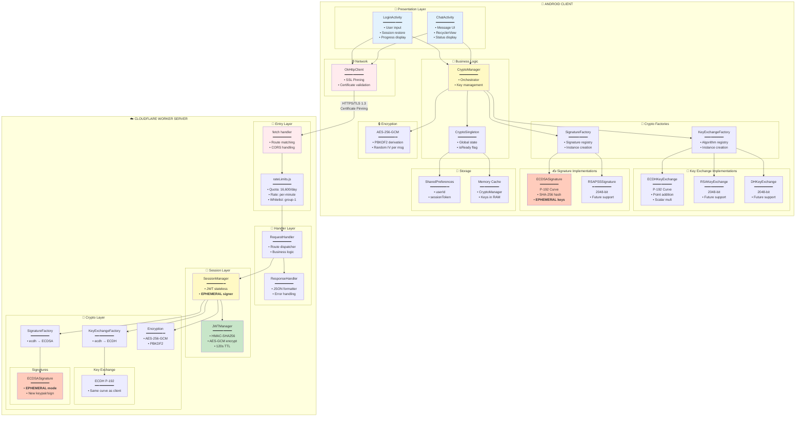

---

## 🔄 2. LUỒNG HOÀN CHỈNH VỚI EPHEMERAL SIGNATURES

```mermaid
sequenceDiagram
    autonumber

    participant U as 👤 User
    participant C as 📱 Client
    participant CM as 🔐 CryptoManager
    participant N as 🌐 Network
    participant S as ☁️ Server
    participant SM as 🎫 SessionManager
    participant JWT as 🔑 JWTManager

    rect rgb(230, 245, 255)
    Note over U,JWT: 🎬 PHASE 1: SESSION CREATION

    U->>C: Enter userId: "group-1"
    C->>CM: initializeForUser("group-1")
    CM->>CM: ✅ Create ECDH instance<br/>✅ Create ECDSA instance

    C->>N: POST /session/create<br/>{algorithm: "ecdh",<br/>curveParameters: {...}}
    N->>S: HTTPS Request
    S->>S: ✅ checkQuota("group-1")<br/>16,600/day OK

    S->>SM: createSession("ecdh", params, "group-1")

    Note over SM: 🔑 Key Exchange Keys (long-term for session)
    SM->>SM: Generate ECDH keypair<br/>privateKey_server (fixed)<br/>publicKey_server

    Note over SM: ✍️ EPHEMERAL Signature Keys (1-time use)
    SM->>SM: 🆕 generateEphemeralSignatureKeyPair()<br/>signPriv_ephemeral_1<br/>signPub_ephemeral_1

    SM->>JWT: createEncryptedJWT({<br/>privateKey_server,<br/>sharedSecret: null,<br/>algorithmParams})
    JWT->>JWT: 🔐 AES-GCM encrypt sensitive data<br/>🔏 HMAC-SHA256 sign JWT
    JWT-->>SM: sessionToken (encrypted JWT)

    SM->>SM: Sign session data<br/>with signPriv_ephemeral_1
    SM->>SM: sessionSignature {r, s, hash}

    SM-->>S: {sessionToken,<br/>publicKey_server,<br/>signPub_ephemeral_1,<br/>sessionSignature}

    S-->>N: 200 OK Response
    N-->>C: Session created

    C->>C: ✅ Store sessionToken<br/>✅ Store publicKey_server<br/>✅ Store signPub_ephemeral_1

    C->>CM: verifyServerSignature(<br/>sessionData,<br/>sessionSignature,<br/>signPub_ephemeral_1)
    CM->>CM: ✅ ECDSA verify
    CM-->>C: ✅ VALID - Server authenticated
    end

    rect rgb(255, 250, 230)
    Note over U,JWT: 🔑 PHASE 2: KEY EXCHANGE

    C->>CM: generateKeyPair()
    CM->>CM: Generate ECDH keypair<br/>privateKey_client<br/>publicKey_client

    Note over CM: ✍️ NEW EPHEMERAL Signature Keys
    CM->>CM: 🆕 generateEphemeralSignatureKeyPair()<br/>signPriv_ephemeral_2<br/>signPub_ephemeral_2

    CM->>CM: Sign publicKey_client<br/>with signPriv_ephemeral_2
    CM-->>C: {publicKey_client,<br/>clientSignature,<br/>signPub_ephemeral_2}

    C->>N: POST /session/exchange<br/>{sessionToken,<br/>clientPublicKey,<br/>clientPublicKeySignature,<br/>clientSignaturePublicKey}
    N->>S: HTTPS Request

    S->>SM: getSession(sessionToken, "group-1")
    SM->>JWT: verifyToken(sessionToken)
    JWT->>JWT: ✅ HMAC verify<br/>✅ Check expiry<br/>🔓 Decrypt encrypted data
    JWT-->>SM: {privateKey_server, algorithmParams}

    S->>S: verifySignature(<br/>clientPublicKey,<br/>clientPublicKeySignature,<br/>clientSignaturePublicKey)
    S->>S: ✅ Client signature VALID

    SM->>SM: validatePublicKey(clientPublicKey)
    SM->>SM: ✅ Point on curve

    SM->>SM: computeSharedSecret<br/>= clientPublicKey × privateKey_server

    SM->>JWT: updateSession({<br/>...previousData,<br/>sharedSecret})
    JWT->>JWT: 🔐 Re-encrypt with sharedSecret
    JWT-->>SM: newSessionToken

    SM-->>S: {success: true,<br/>newSessionToken,<br/>clientSignatureVerified: true}
    S-->>N: 200 OK
    N-->>C: Key exchange complete

    C->>CM: computeSharedSecret(publicKey_server)
    CM->>CM: sharedSecret<br/>= publicKey_server × privateKey_client
    CM->>CM: ✅ SAME sharedSecret as server!

    CM->>CM: deriveAESKey(sharedSecret)<br/>PBKDF2 → AES-256 key

    C->>C: 💾 Save to CryptoSingleton<br/>✅ Encryption ready
    end

    rect rgb(230, 255, 230)
    Note over U,JWT: 💬 PHASE 3: SEND MESSAGE

    U->>C: Type: "hello"

    C->>CM: encrypt("hello")
    CM->>CM: AES-256-GCM encrypt<br/>IV = random(12 bytes)
    CM-->>C: encryptedMessage

    Note over CM: ✍️ NEW EPHEMERAL Signature Keys (#3)
    CM->>CM: 🆕 generateEphemeralSignatureKeyPair()<br/>signPriv_ephemeral_3<br/>signPub_ephemeral_3

    CM->>CM: Sign encryptedMessage<br/>with signPriv_ephemeral_3
    CM-->>C: {messageSignature,<br/>signPub_ephemeral_3}

    C->>N: POST /message/send<br/>{sessionToken,<br/>encryptedMessage,<br/>messageSignature,<br/>clientSignaturePublicKey}
    N->>S: HTTPS Request

    S->>SM: getSession(sessionToken, "group-1")
    SM->>JWT: 🔓 Decrypt JWT → sharedSecret

    S->>S: verifySignature(<br/>encryptedMessage,<br/>messageSignature,<br/>clientSignaturePublicKey)
    S->>S: ✅ Message signature VALID

    S->>S: deriveAESKey(sharedSecret)
    S->>S: 🔓 AES-256-GCM decrypt
    S->>S: Plaintext: "hello"

    S->>S: Generate response:<br/>"Hello! Nice to meet you 👋"

    S->>S: 🔐 AES-256-GCM encrypt response

    Note over SM: ✍️ NEW EPHEMERAL Signature Keys (#4)
    SM->>SM: 🆕 generateEphemeralSignatureKeyPair()<br/>signPriv_ephemeral_4<br/>signPub_ephemeral_4

    SM->>SM: Sign encryptedResponse<br/>with signPriv_ephemeral_4
    SM-->>S: {responseSignature,<br/>signPub_ephemeral_4}

    S->>SM: refreshSession(sessionToken)
    SM->>JWT: Update JWT (exp += 120s)
    JWT-->>SM: refreshedToken

    S-->>N: 200 OK<br/>{encryptedResponse,<br/>responseSignature,<br/>serverSignaturePublicKey,<br/>sessionToken}
    N-->>C: Response received

    C->>CM: verifySignatureWithPublicKey(<br/>encryptedResponse,<br/>responseSignature,<br/>serverSignaturePublicKey)
    CM->>CM: ✅ ECDSA verify with ephemeral key
    CM-->>C: ✅ Server response authentic

    C->>CM: decrypt(encryptedResponse)
    CM->>CM: 🔓 AES-256-GCM decrypt
    CM-->>C: "Hello! Nice to meet you 👋"

    C->>U: 💬 Display message
    C->>C: 💾 Update sessionToken
    end

    rect rgb(255, 235, 238)
    Note over U,JWT: 🚪 LOGOUT
    U->>C: Click Logout
    C->>N: POST /session/delete<br/>{sessionToken}
    N->>S: Delete session
    S-->>N: 200 OK
    C->>C: 🗑️ Clear CryptoSingleton<br/>🗑️ Clear SharedPreferences
    C->>U: Return to login
    end
```

---

## 🏗️ 3. MÔ HÌNH TỔNG QUÁT CHO MỌI THUẬT TOÁN

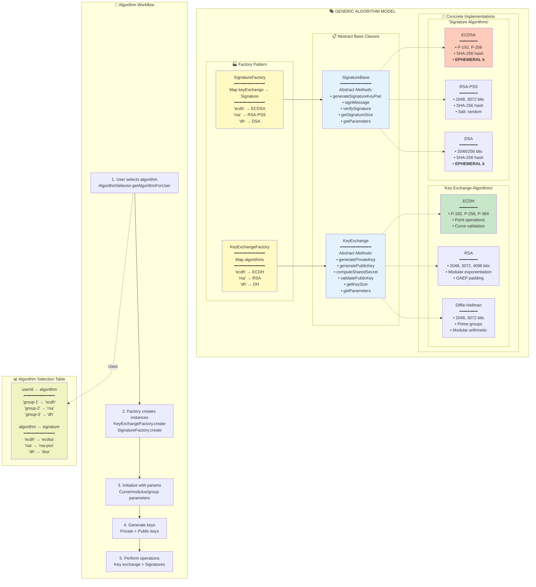

---

## 🎯 4. ECDH P-192 - CHI TIẾT IMPLEMENTATION

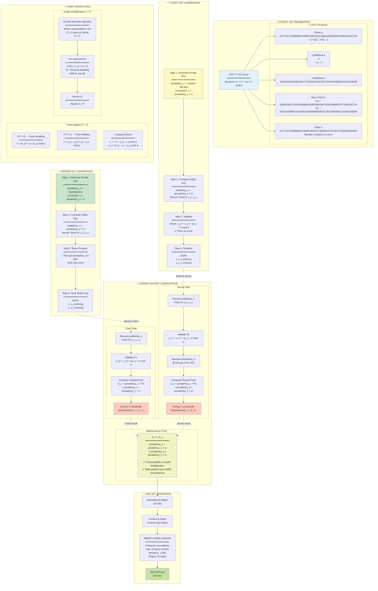

---

## ✍️ 5. EPHEMERAL SIGNATURE MODEL

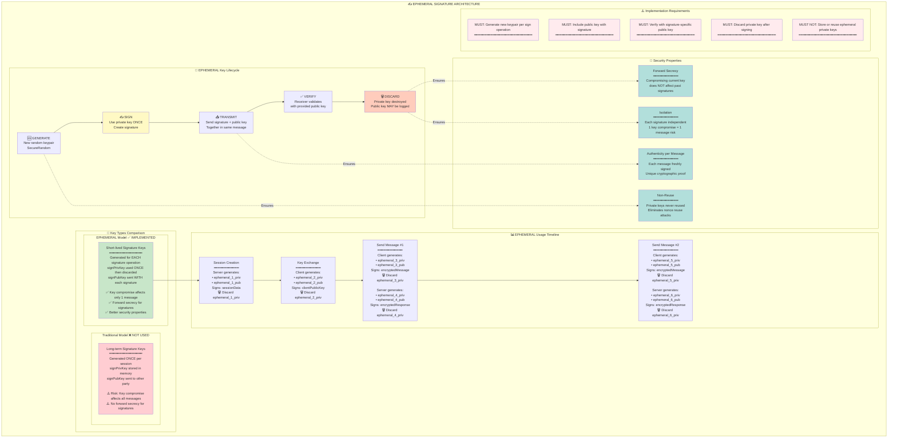

---

## 🔒 6. ECDSA P-192 SIGNATURE - CHI TIẾT

```mermaid
graph TB
    subgraph "✍️ ECDSA P-192 SIGNATURE ALGORITHM"
        subgraph "📋 Parameters Same as ECDH"
            SP[Uses SAME P-192 Curve<br/>━━━━━━━━━━━━━━━━<br/>p, a, b, G, n identical<br/>Reuses curve arithmetic]
        end

        subgraph "🔑 EPHEMERAL Keypair Generation"
            EK1[Generate Random<br/>━━━━━━━━━━━━━━━━<br/>privateKey = random 192 bits<br/>1 < privateKey < n]

            EK2[Compute Public Key<br/>━━━━━━━━━━━━━━━━<br/>publicKey = privateKey × G<br/>Point x, y]

            EK3[🆕 NEW keypair for EACH signature<br/>━━━━━━━━━━━━━━━━<br/>Forward secrecy<br/>Non-reuse]

            EK1 --> EK2 --> EK3
        end

        subgraph "✍️ SIGNING PROCESS"
            SIGN1[Input: message string<br/>━━━━━━━━━━━━━━━━<br/>e.g., encryptedMessage]

            SIGN2[Step 1: Hash Message<br/>━━━━━━━━━━━━━━━━<br/>SHA-256 message<br/>hash = BigInt from bytes<br/>hash mod n]

            SIGN3[Step 2: Generate Random k<br/>━━━━━━━━━━━━━━━━<br/>k = SecureRandom 192 bits<br/>1 < k < n<br/><b>EPHEMERAL nonce</b>]

            SIGN4[Step 3: Compute r<br/>━━━━━━━━━━━━━━━━<br/>Point R = k × G<br/>r = R.x mod n<br/>If r = 0, regenerate k]

            SIGN5[Step 4: Compute s<br/>━━━━━━━━━━━━━━━━<br/>k_inv = k⁻¹ mod n<br/>s = k_inv × hash + r × privateKey mod n<br/>If s = 0, regenerate k]

            SIGN6[Output: Signature<br/>━━━━━━━━━━━━━━━━<br/>r, s, hash, algorithm]

            SIGN1 --> SIGN2 --> SIGN3 --> SIGN4 --> SIGN5 --> SIGN6
        end

        subgraph "✅ VERIFICATION PROCESS"
            VER1[Input: message, signature, publicKey<br/>━━━━━━━━━━━━━━━━<br/>signature: r, s<br/>publicKey: ephemeral from signer]

            VER2[Step 1: Validate r, s<br/>━━━━━━━━━━━━━━━━<br/>0 < r < n<br/>0 < s < n<br/>Reject if invalid]

            VER3[Step 2: Hash Message<br/>━━━━━━━━━━━━━━━━<br/>hash = SHA-256 message<br/>Same as signing]

            VER4[Step 3: Compute w<br/>━━━━━━━━━━━━━━━━<br/>w = s⁻¹ mod n]

            VER5[Step 4: Compute u1, u2<br/>━━━━━━━━━━━━━━━━<br/>u1 = hash × w mod n<br/>u2 = r × w mod n]

            VER6[Step 5: Compute Point<br/>━━━━━━━━━━━━━━━━<br/>P1 = u1 × G<br/>P2 = u2 × publicKey<br/>P = P1 + P2]

            VER7[Step 6: Verify<br/>━━━━━━━━━━━━━━━━<br/>v = P.x mod n<br/>✅ Valid if v = r<br/>❌ Invalid if v ≠ r]

            VER1 --> VER2 --> VER3 --> VER4 --> VER5 --> VER6 --> VER7
        end

        subgraph "🔐 Security Critical Points"
            SEC1[Random k Generation<br/>━━━━━━━━━━━━━━━━<br/>⚠️ MUST be random<br/>⚠️ MUST be unique per signature<br/>⚠️ Reusing k reveals privateKey]

            SEC2[Ephemeral Private Key<br/>━━━━━━━━━━━━━━━━<br/>✅ Generated fresh each time<br/>✅ Used once<br/>✅ Immediately discarded]

            SEC3[Public Key Distribution<br/>━━━━━━━━━━━━━━━━<br/>✅ Sent with signature<br/>✅ Receiver MUST use this key<br/>✅ NOT a stored/session key]
        end

        subgraph "📦 Data Structures"
            DS1["Signature Object
━━━━━━━━━━━━━━━━
{
  r: 'BigInt string',
  s: 'BigInt string',
  messageHash: 'BigInt string',
  algorithm: 'ECDSA-P192'
}"]
            DS2["Public Key Object
━━━━━━━━━━━━━━━━
{
  x: 'BigInt string',
  y: 'BigInt string'
}"]

            DS3["SignatureWithPublicKey
━━━━━━━━━━━━━━━━
{
  signature: Signature,
  publicKey: PublicKey
}

✅ Always sent together"]

        EK3 --> SIGN1
        SIGN6 --> DS1
        EK2 --> DS2
        DS1 --> DS3
        DS2 --> DS3
        DS3 --> VER1

        SIGN3 -.->|Critical| SEC1
        EK3 -.->|Ensures| SEC2
        DS3 -.->|Implements| SEC3
    end

    style SP fill:#e3f2fd
    style EK3 fill:#c8e6c9
    style SIGN3 fill:#fff9c4
    style SIGN6 fill:#ffccbc
    style VER7 fill:#c8e6c9
    style SEC1 fill:#ffebee
    style SEC2 fill:#c8e6c9
    style SEC3 fill:#c8e6c9
    end
    style DS3 fill:#fff9c4
```

---

## 🎫 7. JWT TOKEN STRUCTURE

```mermaid
graph TB
    subgraph "🎫 JWT TOKEN ANATOMY"
        JWT[<b>sessionToken</b><br/>━━━━━━━━━━━━<br/>header.payload.signature]

        subgraph "📋 Header base64url"
            H1["{ 'alg': 'HS256', 'typ': 'JWT' }"]
        end

        subgraph "📦 Payload base64url"
            P1[Public Claims<br/>━━━━━━━━━━━━]
            P2["iss: SecureChat<br/>sub: group-1"]
            P3["sid: c3c351f2a8d...<br/>sessionId random 64 hex chars"]
            P4["algorithm: ecdh<br/>publicKey: {x, y}"]
            P5["createdAt: timestamp<br/>lastActivity: timestamp"]
            P6["iat: issued at<br/>exp: iat + 120"]

            P7[🔐 Encrypted Data<br/>━━━━━━━━━━━━]
            P8["encryptedData: aW52YWxpZCB0b2tlbg..."]

            P1 --> P2
            P1 --> P3
            P1 --> P4
            P1 --> P5
            P1 --> P6
            P7 --> P8
        end

        subgraph "🔏 Signature"
            S1[HMAC-SHA256<br/>━━━━━━━━━━━━<br/>base64url header<br/>+ <br/>+ base64url payload<br/>+ jwtSecret]
        end

        H1 --> JWT
        P1 --> JWT
        P7 --> JWT
        S1 --> JWT
    end

    subgraph "🔐 Encrypted Data Contents"
        ED[Before Encryption - Sensitive Fields<br/>━━━━━━━━━━━━━━━━━━━━━━━━━]

        ED1["privateKey - BigInt string
Server's ECDH private key
⚠️ CRITICAL - must be encrypted"]

ED2["sharedSecret - BigInt string or null
Computed after key exchange
null before exchange
⚠️ CRITICAL - AES key derived from this"]

ED3["algorithmParams - p, a, b, Gx, Gy, order
Curve parameters if custom
null if using defaults"]

        ED --> ED1
        ED --> ED2
        ED --> ED3
    end

    subgraph "🔒 Encryption Process"
        ENC1[Step 1: Derive Encryption Key<br/>━━━━━━━━━━━━━━━━━━━<br/>keyMaterial = jwtSecret + userId<br/>encryptionKey = SHA-256keyMaterial<br/>Take first 32 bytes]

        ENC2["Step 2: Prepare Sensitive Data
━━━━━━━━━━━━━━━━━━━
sensitiveData =
- privateKey
- sharedSecret
- algorithmParams"]

        ENC3[Step 3: AES-256-GCM Encrypt<br/>━━━━━━━━━━━━━━━━━━━<br/>iv = random 12 bytes<br/>ciphertext = encrypt_and_auth<br/>tag = 16 bytes authentication tag]

        ENC4[Step 4: Concatenate & Encode<br/>━━━━━━━━━━━━━━━━━━━<br/>blob = iv + ciphertext + tag<br/>encryptedData = base64urlblob]

        ENC1 --> ENC2 --> ENC3 --> ENC4
        ENC4 -.->|Stored in| P8
    end

    subgraph "🔓 Decryption Process"
        DEC1[Step 1: Verify JWT HMAC<br/>━━━━━━━━━━━━━━━━━━━<br/>Recompute HMAC signature<br/>Compare with token signature<br/>✅ Reject if mismatch]

        DEC2[Step 2: Check Expiry<br/>━━━━━━━━━━━━━━━━━━━<br/>now = current timestamp<br/>✅ Valid if now < exp<br/>❌ Expired if now >= exp]

        DEC3[Step 3: Derive Decryption Key<br/>━━━━━━━━━━━━━━━━━━━<br/>SAME process as encryption<br/>encryptionKey = SHA-256jwtSecret + userId]

        DEC4["Step 4: Decode & Split
━━━━━━━━━━━━━━━━━━━
blob: base64url decode
iv: first 12 bytes
ciphertext: middle bytes
tag: last 16 bytes"]

        DEC5[Step 5: AES-256-GCM Decrypt<br/>━━━━━━━━━━━━━━━━━━━<br/>plaintext = decrypt_and_verify<br/>✅ Success: get sensitive data<br/>❌ Fail: authentication error]

        DEC1 --> DEC2 --> DEC3 --> DEC4 --> DEC5
    end

    subgraph "🔄 JWT Lifecycle"
        LIFE1[Creation<br/>━━━━━━━━━━━━<br/>POST /session/create<br/>privateKey encrypted<br/>sharedSecret = null<br/>exp = now + 120s]

        LIFE2[Update<br/>━━━━━━━━━━━━<br/>POST /session/exchange<br/>sharedSecret added<br/>Re-encrypt all data<br/>exp = now + 120s]

        LIFE3[Refresh<br/>━━━━━━━━━━━━<br/>POST /message/send<br/>lastActivity updated<br/>exp = now + 120s<br/>New token issued]

        LIFE4[Expiry<br/>━━━━━━━━━━━━<br/>After 120 seconds<br/>Token invalid<br/>Must re-login]

        LIFE1 --> LIFE2 --> LIFE3 --> LIFE4
    end

    ED1 -.->|Encrypted| ENC2
    ED2 -.->|Encrypted| ENC2
    ED3 -.->|Encrypted| ENC2
    P8 -.->|Contains| ENC4

    style JWT fill:#fff9c4
    style H1 fill:#e3f2fd
    style P1 fill:#e3f2fd
    style P7 fill:#ffccbc
    style S1 fill:#c8e6c9
    style ED1 fill:#ffebee
    style ED2 fill:#ffebee
    style ED3 fill:#ffebee
    style ENC4 fill:#ffccbc
    style DEC5 fill:#c8e6c9
    style LIFE4 fill:#ffccbc
```

---

## 💬 8. MESSAGE ENCRYPTION/DECRYPTION CHI TIẾT

```mermaid
graph LR
    subgraph "📤 CLIENT ENCRYPTION FLOW"
        CE1["👤 User Input
'hello'"]
        CE2[Get AES Key<br/>from CryptoManager<br/>Derived from sharedSecret]
        CE3[Generate IV<br/>Random 12 bytes<br/>crypto.getRandomValues]
        CE4[Prepare Cipher<br/>AES-256-GCM<br/>mode: ENCRYPT]
        CE5[Encrypt + Auth<br/>plaintext + AAD<br/>→ ciphertext + tag]
        CE6[Concatenate<br/>IV 12 + ciphertext + tag 16]
        CE7[Base64 Encode<br/>Final encryptedMessage]

        CE1 --> CE2 --> CE3 --> CE4 --> CE5 --> CE6 --> CE7
    end

    subgraph "✍️ CLIENT SIGNING"
        CS1[Input<br/>encryptedMessage]
        CS2[🆕 Generate<br/>EPHEMERAL keypair<br/>signPriv_eph<br/>signPub_eph]
        CS3[Hash Message<br/>SHA-256<br/>→ digest]
        CS4[ECDSA Sign<br/>with signPriv_eph<br/>→ r, s]
        CS5["Create Signature
r, s, hash, algorithm"]
        CS6["Package Result
signature
signPub_eph"]
        CS7[🗑️ Discard<br/>signPriv_eph]

        CS1 --> CS2 --> CS3 --> CS4 --> CS5 --> CS6 --> CS7
    end

    CE7 --> CS1

    subgraph "🌐 NETWORK TRANSMISSION"
        NT1[Build Request<br/>POST /message/send]
        NT2["JSON Body
sessionToken,
encryptedMessage,
messageSignature,
clientSignaturePublicKey"]
        NT3["HTTPS/TLS 1.3
Certificate Pinning
Verify SPKI hash"]
        NT4[Encrypted Tunnel<br/>TLS encryption layer]
        NT5[Cloudflare Worker<br/>Receives request]

        NT1 --> NT2 --> NT3 --> NT4 --> NT5
    end

    CS6 --> NT1

    subgraph "✅ SERVER SIGNATURE VERIFICATION"
        SV1[Extract Signature<br/>r, s, hash<br/>+ ephemeral publicKey]
        SV2[Hash Received Message<br/>SHA-256 encryptedMessage]
        SV3[Compare Hashes<br/>received hash = computed hash]
        SV4[ECDSA Verify<br/>with ephemeral publicKey<br/>NOT stored key]
        SV5{Signature<br/>Valid?}
        SV6[✅ ACCEPT<br/>Proceed to decryption]
        SV7[❌ REJECT<br/>Return 401 error]

        SV1 --> SV2 --> SV3 --> SV4 --> SV5
        SV5 -->|Yes| SV6
        SV5 -->|No| SV7
    end

    NT5 --> SV1

    subgraph "🔓 SERVER DECRYPTION"
        SD1[Get Session<br/>Verify JWT token<br/>🔓 Decrypt JWT]
        SD2[Extract sharedSecret<br/>from decrypted JWT]
        SD3[Derive AES Key<br/>PBKDF2 sharedSecret<br/>Same as client]
        SD4[Base64 Decode<br/>encryptedMessage]
        SD5["Extract Components
IV = bytes[0..11]
ciphertext = bytes[12..-17]
tag = bytes[-16..-1]"]
        SD6[AES-256-GCM Decrypt<br/>Verify authentication tag]
        SD7["🔓 Plaintext
hello"]

        SD1 --> SD2 --> SD3 --> SD4 --> SD5 --> SD6 --> SD7
    end

    SV6 --> SD1

    subgraph "🤖 SERVER RESPONSE GENERATION"
        SR1["Generate Response
Hello! Nice to meet you 👋"]
        SR2[AES-256-GCM Encrypt<br/>Same key as client]
        SR3[encryptedResponse<br/>base64]
        SR4[🆕 Generate NEW<br/>EPHEMERAL keypair<br/>signPriv_eph_resp<br/>signPub_eph_resp]
        SR5[ECDSA Sign<br/>encryptedResponse<br/>with signPriv_eph_resp]
        SR6["responseSignature
{
  r,
  s,
  hash
}"]
        SR7[🗑️ Discard<br/>signPriv_eph_resp]
        SR8[Refresh JWT<br/>exp += 120s<br/>newSessionToken]

        SR1 --> SR2 --> SR3 --> SR4 --> SR5 --> SR6 --> SR7 --> SR8
    end

    SD7 --> SR1

    subgraph "📥 CLIENT RESPONSE VERIFICATION"
        CV1["Receive Response
{
  encryptedResponse,
  responseSignature,
  serverSignaturePublicKey,
  newSessionToken
}"]
        CV2[Extract Signature<br/>+ ephemeral publicKey]
        CV3[ECDSA Verify<br/>with serverSignaturePublicKey<br/>NOT session creation key]
        CV4{Signature<br/>Valid?}
        CV5[✅ ACCEPT<br/>Decrypt response]
        CV6[❌ REJECT<br/>Show security alert]

        CV1 --> CV2 --> CV3 --> CV4
        CV4 -->|Yes| CV5
        CV4 -->|No| CV6
    end

    SR8 --> CV1

    subgraph "🔓 CLIENT DECRYPTION"
        CD1[Base64 Decode<br/>encryptedResponse]
        CD2[Extract IV + data + tag]
        CD3[AES-256-GCM Decrypt<br/>with same AES key]
        CD4["🔓 Plaintext
Hello! Nice to meet you 👋"]
        CD5[💬 Display in UI<br/>Chat message]
        CD6[💾 Update sessionToken<br/>Save newSessionToken]

        CD1 --> CD2 --> CD3 --> CD4 --> CD5 --> CD6
    end

    CV5 --> CD1

    style CE1 fill:#e3f2fd
    style CE7 fill:#ffccbc
    style CS2 fill:#fff9c4
    style CS6 fill:#ffccbc
    style CS7 fill:#ffebee
    style SV6 fill:#c8e6c9
    style SV7 fill:#ffcdd2
    style SD7 fill:#e1f5fe
    style SR4 fill:#fff9c4
    style SR6 fill:#ffccbc
    style SR7 fill:#ffebee
    style CV5 fill:#c8e6c9
    style CV6 fill:#ffcdd2
    style CD5 fill:#c8e6c9
```

---

## 🔒 9. SECURITY LAYERS

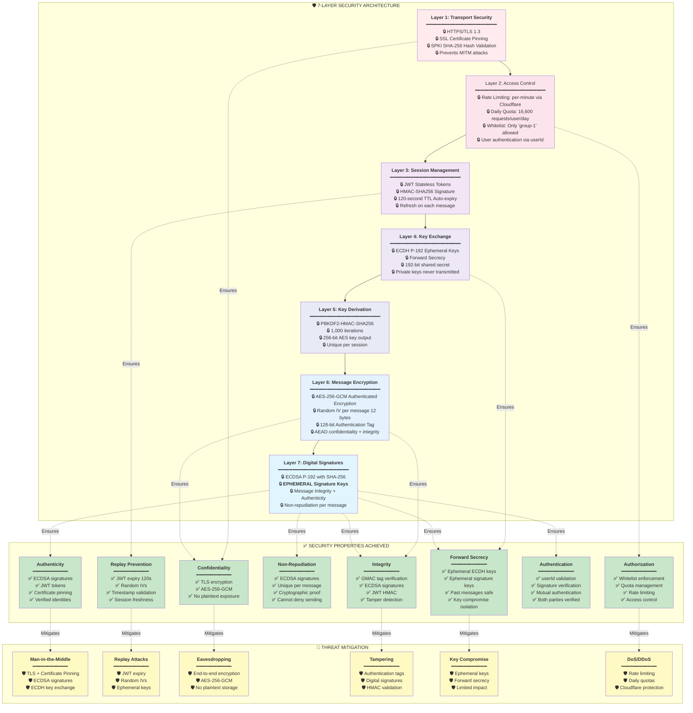

---

## 🎬 10. TỔNG KẾT - EPHEMERAL SIGNATURE WORKFLOW

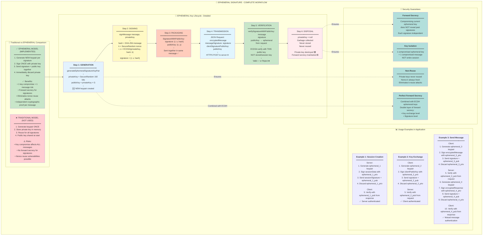

---

## 📚 LEGEND

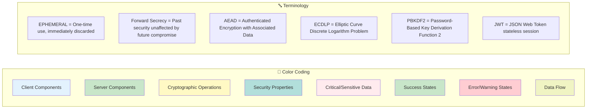
